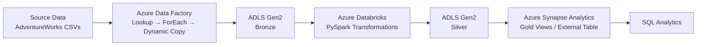

## Architecture



## Project Overview

This project demonstrates an end-to-end Azure data engineering pipeline for processing retail data.

The pipeline ingests raw CSV data using Azure Data Factory, stores it in ADLS Gen2, transforms and cleans the data using PySpark in Azure Databricks, and exposes the processed data for analytics through Azure Synapse Analytics.


## Technology Stack

- Azure Data Factory
- Azure Data Lake Storage Gen2
- Azure Databricks
- PySpark
- Azure Synapse Analytics
- SQL
- GitHub

## Pipeline Flow

1. **Source Data**  
   AdventureWorks retail CSV files.

2. **Azure Data Factory**  
   Uses Lookup, ForEach and Dynamic Copy activities to ingest the source files.

3. **ADLS Gen2 - Bronze**  
   Stores the ingested raw data.

4. **Azure Databricks**  
   Uses PySpark to clean and transform the data.

5. **ADLS Gen2 - Silver**  
   Stores the transformed data in Parquet format.

6. **Azure Synapse Analytics**  
   Creates Gold views and an external table for SQL-based analytics.


   ## Key Features

- Dynamic ingestion of multiple CSV files using Azure Data Factory
- Bronze, Silver and Gold data lake architecture
- PySpark-based data cleaning and transformation
- Parquet-based Silver layer
- SQL views for analytics using Azure Synapse
- External table creation for analytical access
- Azure Managed Identity for secure data access
- GitHub-based project version control

## Data Lake Layers

### Bronze
Raw CSV data ingested from the source using Azure Data Factory.

### Silver
Cleaned and transformed data processed using PySpark and stored in Parquet format.

### Gold
Analytics-ready data exposed through Azure Synapse views and external tables.


## Project Structure

```text
azure-retail-data-engineering-pipeline/
│
├── README.md
├── Silver_layer.ipynb
│
├── adf/
│   ├── ARMTemplateForFactory.json
│   └── ARMTemplateParametersForFactory.json
│
└── synapse/
    ├── views.sql
    └── external_tables.sql
