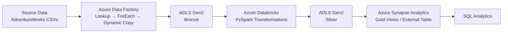

## Architecture

## Project Overview

This project demonstrates an end-to-end Azure data engineering pipeline for processing retail data.

The pipeline ingests raw CSV data using Azure Data Factory, stores it in ADLS Gen2, transforms and cleans the data using PySpark in Azure Databricks, and exposes the processed data for analytics through Azure Synapse Analytics.
